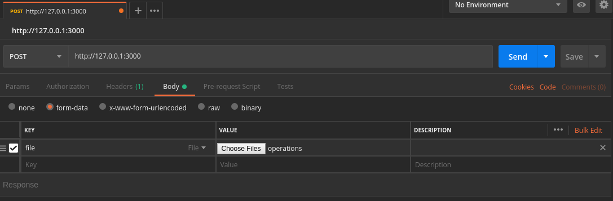

# POC Clojure — Authorizer

## Requisites

* Leiningen
* Docker

## Build

Run the following commands on the terminal.

    $ ./build
    
The build script will run the tests and if success, create the docker image named `poc-clojure/authorizer`.

## Instalation

Run the following commands on the terminal.

    $ ./run
    
Run script will start the service at default port 3000.

The script accepts one parameter to start the service on another port. 
Example: 
If you want to run the service in the port 8180.

    $ ./run 8180
    
To stop the service you can use the following command.

    $ ./stop

##Usage

* Application expose a http service, which expects a multipart/form POST message containing a file with json lines as input.

    {"account": { "activeCard": true, "availableLimit": 100 } }
    {"transaction": { "merchant": "Burger King", "amount": 20, "time": "2019-02-13T10:00:00.000Z" } }
    {"transaction": { "merchant": "Habbib's", "amount": 90, "time": "2019-02-13T11:00:00.000Z" } }    

* The output is a list of json lines that contain the result to respective line in the input file.

    { "account": { "activeCard": true, "availableLimit": 100 }, "violations": [] }
    { "account": { "activeCard": true, "availableLimit": 80 }, "violations": [] }
    { "account": { "activeCard": true, "availableLimit": 80 }, "violations": [ "insufficient-limit" ] }
    
## Examples

####Using cUrl
    $ curl -XPOST -F 'file=@/file-path/operations' http:/127.0.0.1:3000/
   
Where:   
`/file-path/operations` is the file that contains the input json lines 
`http:/127.0.0.1:3000` is the url where the service is available 

####Using Postman
* Select POST method.
* Set service address. Ex: `http:/127.0.0.1:3000/`
* Select the `Body` tab.
* Select the `form-data` option.
* Add `KEY=file` `Type=file`.
* In the `VALUE` column, choose a file containing the expected content.
* Click on the `Send` button.

